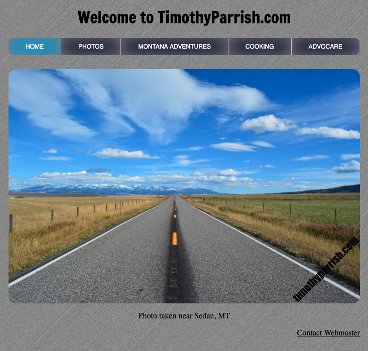
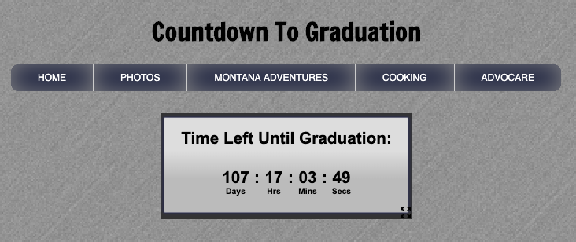

## First side project I built for fun during my freshmen year of college

  

This website was the first side project that I did and I wanted to save this here as its memorial. This was just a fun project that I wanted to do with HTML and CSS, before I learned about JavaScript and ReactJS. This site was originally hosted by GoDaddy but I migrated it to this location for record keeping.

The site can be viewed at [https://timparrish.github.io/legacy_website/index.html](https://timparrish.github.io/legacy_website/index.html).

The '/hidden' route was a easter egg I put in for myself and would update it to show how much time was left in the school semester. I updated it one last time to show the days left until I graduate with my Computer Science Degree.

The easter egg page I put in for myself can be found [HERE](https://timparrish.github.io/legacy_website/html/hidden.html)

Here is the sample of the graduation countdown before the timer runs out. This uses the utility [Free Countdown Timer](https://www.timeanddate.com/clocks/freecountdown.html). After my graduation date has past, the page will just count up indefinetely showing how long I have had my Computer Science degree.

  

